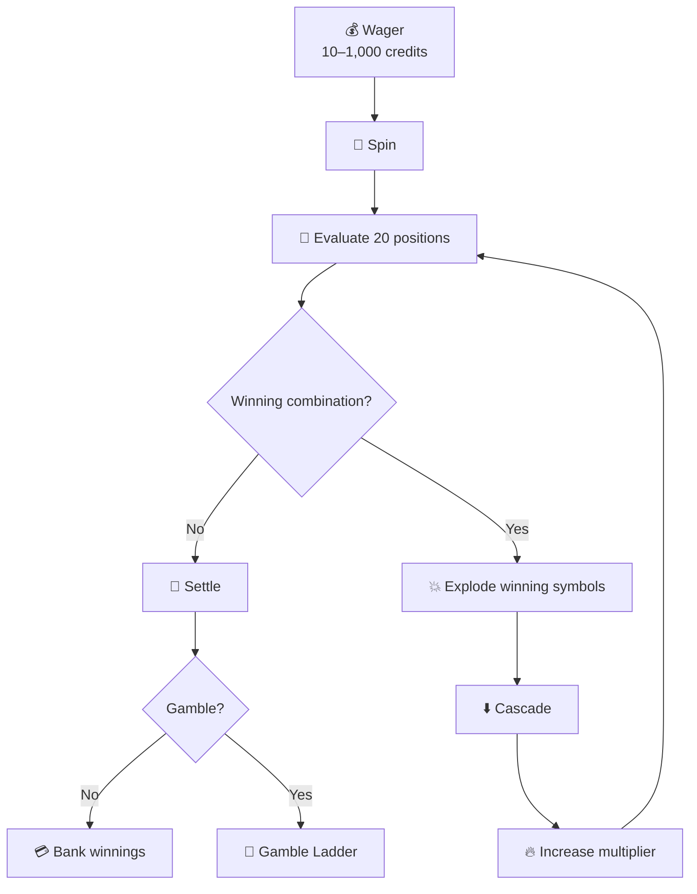

# ⚡ KRONOS CASINO — WRATH OF TITANS

> **High-volatility 5×4 video slot inspired by ancient Greek mythology.**

**Wrath of Titans** is a high-volatility video slot built around cascading wins, escalating multipliers, Wild symbols, Free Spins, a risk-based Gamble ladder, and the **Titanic Jackpot**.

The game combines a dark mythological aesthetic with high-risk gameplay and opportunities for significant single-spin payouts.

---

## 🎰 Game Overview

| Feature                          | Specification                  |
| -------------------------------- | ------------------------------ |
| **Game**                         | KRONOS CASINO: WRATH OF TITANS |
| **Grid**                         | 5 × 4                          |
| **Visible positions**            | 20                             |
| **Paylines**                     | 25 fixed                       |
| **Volatility**                   | High                           |
| **RTP**                          | 96.50%                         |
| **Hit Frequency**                | ~28.4%                         |
| **Stake**                        | 10–1,000 credits               |
| **Maximum Jackpot**              | x1,500 total stake             |
| **Maximum Avalanche Multiplier** | x5                             |

The 5×4 matrix provides **20 simultaneously visible symbol positions**, while 25 fixed paylines evaluate wins strictly from left to right, starting from Reel 1.

---

## 🏛️ Visual Direction

### The Wrath of Mount Olympus

The visual identity is built around **dark mythic warfare**:

* 🌋 Volcanic obsidian
* 🔥 Blazing gold accents
* 🏛️ Ancient marble relics
* ⚔️ Mythological warfare
* 👑 Immortal gods and titans

The experience is designed for players looking for **intense volatility, explosive chain reactions, and high single-spin exposure**.

---

## 🎮 Core Gameplay

The basic spin follows four stages:

```text
WAGER
   ↓
SPIN
   ↓
CASCADE
   ↓
SETTLE
```

### 1. Wager

Choose a stake between **10 and 1,000 credits** across 25 paylines.

### 2. Spin

The 20 visible positions are evaluated from left to right.

### 3. Cascade

Winning symbols explode and disappear. New symbols tumble down to fill the empty positions.

### 4. Settle

The resulting credits are banked, or the player can enter the optional **50/50 Gamble ladder**.

---

# 💥 Cascading Gameplay

## Cascading Drops

When a winning combination is formed:

1. Winning symbols explode.
2. Empty positions are created.
3. Remaining symbols tumble downward.
4. New symbols enter the grid.
5. New winning combinations can trigger additional cascades.

This allows multiple consecutive wins to occur within the same paid spin.

---

## 🔥 Avalanche Multiplier

Every consecutive cascade increases the global spin win multiplier.

```text
x1 → x2 → x3 → x4 → x5
```

The multiplier can reach a maximum of **x5** during the avalanche sequence.

---

# 🏆 Titanic Jackpot

The ultimate grid event is the **Titanic Jackpot**.

> Fill **all 20 cells** with the top-tier **Kronos** symbol to instantly award **x1,500 total stake**.

This represents the game's grand-prize cap.

---

# 🗡️ Symbol Hierarchy & Payouts

| Symbol             | Tier        | 3 of a Kind | 4 of a Kind | 5 of a Kind |
| ------------------ | ----------- | ----------: | ----------: | ----------: |
| ⚔️ Blade of Sparta | Low Tier    |        x0.5 |        x1.5 |        x4.0 |
| 🪖 Warrior Helm    | Low Tier    |        x0.8 |        x2.5 |        x6.0 |
| 🛡️ Medusa Shield  | Mid Tier    |        x1.2 |        x4.0 |       x10.0 |
| ⛓️ Chains of Fate  | High Tier   |        x2.0 |        x7.0 |       x18.0 |
| 👑 Wrath of Kronos | Premium Top |        x5.0 |       x20.0 |       x60.0 |
| 🌀 Omega Symbol    | Wild        |       x10.0 |       x35.0 |      x100.0 |

The **Omega Symbol** is the game's special Wild and can substitute for standard paytable symbols.

---

# 🌀 Special Symbols

## Omega Wild

The **Omega Wild** replaces any standard paytable symbol except Scatter and completes the highest possible payline combination.

This makes it one of the most powerful symbols in the base game.

---

## 🟡 Golden Pantheon Scatter

The **Golden Pantheon Scatter** is evaluated anywhere on the 20-cell grid and does not require a specific payline.

### Free Spins

| Scatters | Reward                    |
| -------: | ------------------------- |
|    **3** | 10 Free Spins             |
|    **4** | 15 Free Spins + x10 stake |
|    **5** | 25 Free Spins + x50 stake |

---

# 🔒 Sticky Wilds

During the Free Spins feature, every Wild that lands becomes **sticky**.

A sticky Wild:

* Remains locked for the entire bonus round
* Continues participating in subsequent spins
* Awards **+1 additional Free Spin**

This creates an escalating bonus sequence where the grid can progressively accumulate Wild symbols.

---

# 🎲 Double-or-Nothing Gamble

After settling a win, players can optionally enter the Gamble feature.

### Card Color Guess

**Red vs. Black**

* Probability: **50.0%**
* Correct guess: **x2**
* Incorrect guess: winnings are forfeited

### Card Suit Guess

**Spades / Hearts / Clubs / Diamonds**

* Probability: **25.0%**
* Correct guess: **x4**
* Incorrect guess: winnings are forfeited

The Gamble feature supports up to **5 consecutive guesses** or a maximum of **50,000 credits**.

---

# 📊 Mathematical Model

| Metric                           |        Value |
| -------------------------------- | -----------: |
| **RTP**                          |       96.50% |
| **Volatility**                   |         High |
| **Hit Frequency**                |       ~28.4% |
| **Maximum Avalanche Multiplier** |           x5 |
| **Titanic Jackpot**              | x1,500 stake |

Sequential cascades progressively amplify subsequent prize calculations through the Avalanche Multiplier system.

---

# 🔄 Game Spin Lifecycle



---

# 🧠 Game Design Philosophy

**Wrath of Titans** is built around three core principles:

### ⚔️ High Stakes

The game targets players seeking high-volatility gameplay and large potential single-spin exposure.

### 💥 Escalation

Cascading wins continuously build momentum through the Avalanche Multiplier.

### 🎲 Risk & Reward

The optional Gamble ladder allows players to exchange secured winnings for additional risk and potentially larger rewards.

> *“Fortune favors those bold enough to challenge the immortal gods themselves.”*

— **KRONOS CASINO Creative Manifesto**

---

# 📌 Feature Summary

```text
┌──────────────────────────────────────┐
│        WRATH OF TITANS               │
├──────────────────────────────────────┤
│  5 × 4 Grid                          │
│  20 Visible Positions                │
│  25 Fixed Paylines                   │
│                                      │
│  💥 Cascading Wins                   │
│  🔥 Avalanche Multiplier up to x5    │
│  🌀 Omega Wild                       │
│  🟡 Golden Pantheon Scatter          │
│  🔒 Sticky Wilds                     │
│  🎲 Gamble Ladder                    │
│  👑 Titanic Jackpot x1,500           │
│                                      │
│  RTP: 96.50%                         │
│  Hit Frequency: ~28.4%               │
│  Volatility: HIGH                    │
└──────────────────────────────────────┘
```

---

# 🚀 Project Status

**Concept Specification**

The project is positioned as ready for:

* Mathematical model integration
* Prototype demonstration
* Gameplay implementation
* Further feature development

---

## 🏛️ KRONOS CASINO

### WRATH OF TITANS

**Challenge the gods. Trigger the avalanche. Claim the throne.**
